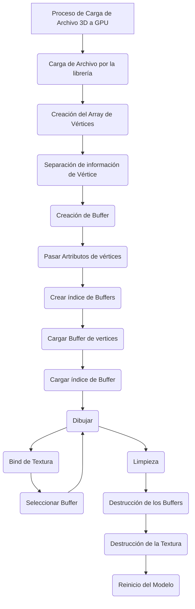

# Carga de Modelos

Los modelos 3D son un conjunto de información de vértices. Estos pueden estar acompañados de información anexa, como color, textura, normal. Esto debe ser acondicionado y medido para ser introducido al buffer de la GPU, que va a devolver los elementos necesarios para llamar al espacio de memoria alojado, y que se ejecute el dibujado de esta estructura de información.

El formato más simple de lectura es el Obj, donde se nos entrega una estructura simple de puntos tridimencionales.

En la actualidad, existen múltiples formatos de información Objetos 3D, es por eso que se utilizará una librería para la carga de información, que acepte múltiples formatos.

La librería utilizada será Assimp.

Básicamente, el flujo de carga es el siguiente:

## 2) Generación de Array de Vértices 

glGenVertexArrays( GLsizei n, GLuint *arrays)

Parametros:
n - Representa el número específico de nombres de arrays a generar.

arrays - Específica cual es el array de vértices generado.

Descripción
glGenVertexArrays Devuelve n nombres de objetos de matriz de vértices en matrices. No se garantiza que los nombres formen un conjunto contiguo de enteros; sin embargo, se garantiza que ninguno de los nombres devueltos estaba en uso inmediatamente antes de la llamada a glGenVertexArrays. 

[glVertexArray](https://registry.khronos.org/OpenGL-Refpages/gl4/html/glGenVertexArrays.xhtml)

glBindVertexArray(GLuint  *array)

array Específica el valor que matriz a vincular.

Descripción
glBindVertexArray vincula el objeto de matriz de vértices con el nombre array. array es el nombre de un objeto de matriz de vértices devuelto previamente por una llamada a glGenVertexArrays, o cero para romper la vinculación existente.

[glBindVertexArray](https://registry.khronos.org/OpenGL-Refpages/gl4/html/glBindVertexArray.xhtml)

