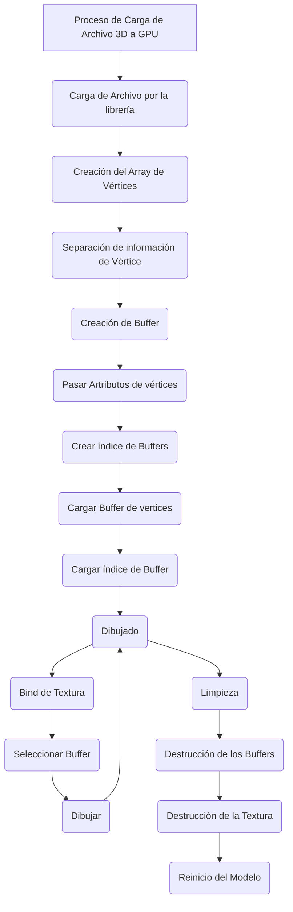

# Carga de Modelos

Los modelos 3D son un conjunto de información de vértices. Estos pueden estar acompañados de información anexa, como color, textura, normal. Esto debe ser acondicionado y medido para ser introducido al buffer de la GPU, que va a devolver los elementos necesarios para llamar al espacio de memoria alojado, y que se ejecute el dibujado de esta estructura de información.

El formato más simple de lectura es el Obj, donde se nos entrega una estructura simple de puntos tridimencionales.

En la actualidad, existen múltiples formatos de información Objetos 3D, es por eso que se utilizará una librería para la carga de información, que acepte múltiples formatos.

La librería utilizada será Assimp.

Básicamente, el flujo de carga es el siguiente:


## 1) Carga de Archivo por la librería

Headers de la librería
```cpp
#include <assimp/Importer.hpp>
#include <assimp/scene.h>
#include <assimp/postprocess.h>
```

Método de carga (LearnOpengl)

```cpp
void loadModel(string path)
{
    Assimp::Importer import;
    const aiScene *scene = import.ReadFile(path, aiProcess_Triangulate | aiProcess_FlipUVs);	
	
    if(!scene || scene->mFlags & AI_SCENE_FLAGS_INCOMPLETE || !scene->mRootNode) 
    {
        cout << "ERROR::ASSIMP::" << import.GetErrorString() << endl;
        return;
    }
    directory = path.substr(0, path.find_last_of('/'));

    processNode(scene->mRootNode, scene);
}  
```

## 2) Generación de Array de Vértices 

Método de generación de Array de Vértices
```cpp

	glGenVertexArrays(1, &VAO);
	glBindVertexArray(VAO);
	creacionBuffersVertices();
	creacionBufferIndices();
	glBindVertexArray(0);

```

glGenVertexArrays( GLsizei n, GLuint *arrays)

Parametros:
n - Representa el número específico de nombres de arrays a generar.

arrays - Específica cual es el array de vértices generado.


Descripción
glGenVertexArrays Devuelve n nombres de objetos de matriz de vértices en matrices. No se garantiza que los nombres formen un conjunto contiguo de enteros; sin embargo, se garantiza que ninguno de los nombres devueltos estaba en uso inmediatamente antes de la llamada a glGenVertexArrays. 

[glVertexArray](https://registry.khronos.org/OpenGL-Refpages/gl4/html/glGenVertexArrays.xhtml)


glBindVertexArray( GLuint  *array)

array - Específica el valor que matriz a vincular.

Descripción
glBindVertexArray vincula el objeto de matriz de vértices con el nombre array. array es el nombre de un objeto de matriz de vértices devuelto previamente por una llamada a glGenVertexArrays, o cero para romper la vinculación existente.

[glBindVertexArray](https://registry.khronos.org/OpenGL-Refpages/gl4/html/glBindVertexArray.xhtml)


## 3) Separación de información de Vértice

Se plantea una estructura de vértice:
```cpp
struct OGLVertex {
  glm::vec3 position;
  glm::vec3 normal;
  glm::vec2 uv;
};

```

Y estructura de malla:

```cpp
struct OGLMesh {
  std::vector<OGLVertex> vertices;
};

```

Método simplificado de carga (ChatGPT)

```cpp

std::vector<Vertex> vertices;
std::vector<unsigned int> indices;

aiMesh* mesh = scene->mMeshes[0]; // Ejemplo: primera malla

for (unsigned int v = 0; v < mesh->mNumVertices; v++) {
    Vertex vertex{};
    vertex.position = { mesh->mVertices[v].x, mesh->mVertices[v].y, mesh->mVertices[v].z };
    vertex.normal   = mesh->HasNormals() ? 
                      glm::vec3(mesh->mNormals[v].x, mesh->mNormals[v].y, mesh->mNormals[v].z) :
                      glm::vec3(0.0f);

    if (mesh->HasTextureCoords(0)) {
        vertex.texCoords = { mesh->mTextureCoords[0][v].x, mesh->mTextureCoords[0][v].y };
    } else {
        vertex.texCoords = { 0.0f, 0.0f };
    }

    vertices.push_back(vertex);
}

for (unsigned int f = 0; f < mesh->mNumFaces; f++) {
    aiFace face = mesh->mFaces[f];
    for (unsigned int i = 0; i < face.mNumIndices; i++) {
        indices.push_back(face.mIndices[i]);
    }
}


```

## 4) Creación de Buffers Vértices

Métodos utilizados para la creación de los buffers.

```cpp

		std::vector<GLuint> mVertexVBO{};
		glGenBuffers(1, &VertexVBO[attributes[attribType]]);
		glBindBuffer(GL_ARRAY_BUFFER,
			mVertexVBO[attributes[attribType]]);
		glVertexAttribPointer(attributes[attribType], dataSize,
			dataType, GL_FALSE, 0, (void*)0);
		glEnableVertexAttribArray(attributes[attribType]);
		glBindBuffer(GL_ARRAY_BUFFER, 0);
```


### glGenBuffers

```cpp
glGenBuffers(
GLsize n,
GLuint * buffers);
```

**Parametros:** 
n - Representa el número específico de nombres de buffer a generar.

Buffer- Específica cual es el array de vértices generado.


**Descripción:** 
glGenBuffers especifica una matriz en la que se almacenan las referencias de los objetos de búfer generados.

[glGenBuffers](https://registry.khronos.org/OpenGL-Refpages/gl4/html/glGenBuffers.xhtml)


### glBindBuffer

```cpp
void glBindBuffer(
GLenum target,
GLuint buffer);
```


**Parametros:** 
target - Especifica el objetivo al que está vinculado el objeto de búfer; dicho objetivo debe ser uno de los objetivos de vinculación de búfer.

buffer- Específica cual es el array de vértices.


**Descripción:** 
glBindBuffer asocia un objeto de búfer a un punto de enlace específico. Al llamar a glBindBuffer, indicando como parámetro target una de las constantes simbólicas permitidas y como parámetro buffer el nombre de un objeto de búfer, se establece la asociación entre ese objeto y el punto de enlace. Si no existe ningún objeto de búfer con ese nombre, se crea uno nuevo. Cuando se asocia un objeto de búfer a un punto de enlace, la asociación previa con ese punto de enlace se anula automáticamente.

[glBindBuffer](https://registry.khronos.org/OpenGL-Refpages/gl4/html/glBindBuffer.xhtml)

### glVertexAttribPointer
```cpp
void glVertexAttribPointer(
GLuint index, 
GLint size, 
GLenum type, 
GLboolean normalized, 
GLsizei stride, 
const void * pointer);
 
void glVertexAttribIPointer(
GLuint index, 
GLint size, 
GLenum type, 
GLsizei stride, 
const void * pointer);
 
void glVertexAttribLPointer(
GLuint index, 
GLint size, 
GLenum type, 
GLsizei stride, 
const void * pointer);
```
**Parametros**
index
Especifica el índice del atributo genérico de vértice que se va a modificar.
size
Especifica el número de componentes por atributo genérico de vértice.
type
Especifica el tipo de datos de cada componente del array. 
stride
Especifica el desplazamiento en bytes entre los atributos genéricos de vértice consecutivos.
pointer
Especifica el desplazamiento del primer componente del primer atributo genérico de vértice en el array, ubicado en el almacenamiento de datos del búfer actualmente vinculado al objetivo GL_ARRAY_BUFFER.

**Descripción**
Las funciones glVertexAttribPointer, glVertexAttribIPointer y glVertexAttribLPointer especifican la ubicación y el formato de datos del array de atributos de vértice genéricos en el índice especificado, que se utilizará durante el proceso de renderizado. El parámetro size indica el número de componentes por atributo y debe ser 1, 2, 3, 4 o GL_BGRA. El parámetro type especifica el tipo de datos de cada componente, y stride indica el desplazamiento en bytes entre un atributo y el siguiente, lo que permite almacenar los vértices y los atributos en un único array o en arrays separados.

[glVertexAttribPointer](https://registry.khronos.org/OpenGL-Refpages/gl4/html/glVertexAttribPointer.xhtml)


### glEnableVertexAttribArray
```cpp
void glEnableVertexAttribArray(
GLuint index);
 
void glDisableVertexAttribArray(
GLuint index);
 
void glEnableVertexArrayAttrib(
GLuint vaobj,
 GLuint index);
 
void glDisableVertexArrayAttrib(
GLuint vaobj,
 GLuint index);
```

**Parámetros:** 
vaobj
Especifica el nombre del objeto de matriz de vértices para las funciones glDisableVertexArrayAttrib y glEnableVertexArrayAttrib.
index
Especifica el índice del atributo genérico de vértice que se habilitará o deshabilitará.

**Descripción:** 
Las funciones glEnableVertexAttribArray y glEnableVertexArrayAttrib habilitan el array de atributos de vértice genérico especificado por índice. La función glEnableVertexAttribArray utiliza el objeto de array de vértices actualmente enlazado para la operación, mientras que glEnableVertexArrayAttrib actualiza el estado del objeto de array de vértices con el ID vaobj.

[glEnableVertexAttribArray](https://registry.khronos.org/OpenGL-Refpages/gl4/html/glEnableVertexAttribArray.xhtml)

